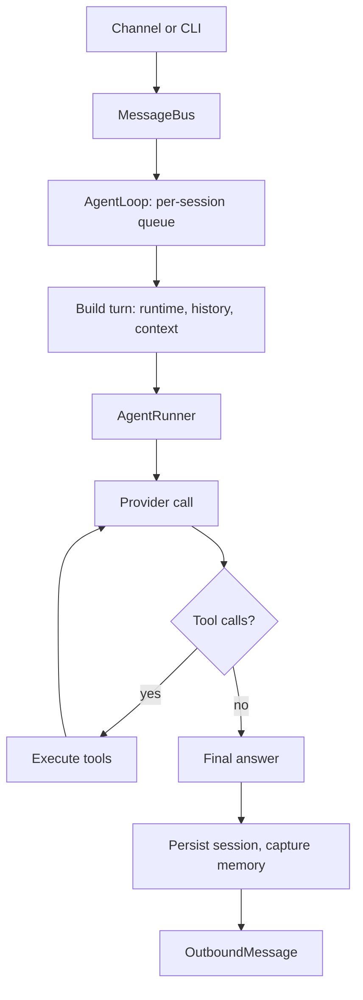

# Mason

**A lightweight, self-hosted personal AI agent framework** — built by Mochi-Sora.

Mason lives in your terminal and in your chat apps. It keeps its prompt small, remembers
what matters, and stays out of the way.

```bash
curl -fsSL https://raw.githubusercontent.com/Mochi-Sora/MasonAgent/main/scripts/install.sh | sh
nanobot agent -m "hello"    # the wizard sets up the provider and model first
```

> The project is **Mason**. The Python package and CLI still ship under the `nanobot`
> name while the rename lands, so every command in this document starts with `nanobot`.

---

## ⭐ Flagship: state-first context

Most agents grow their prompt as the conversation grows. Mason does the opposite.

After every turn, the model is asked to decide what matters *right now* and write it into a
small working state — `memory/state.md`, about 2 KB. That state is injected into the system
prompt on every turn; the full conversation is **not**. When the state changes, the model
rewrites it in place, in-turn, with the `update_state` tool.

The result:

- **The prompt stays small** no matter how long the relationship gets. Only the state block
  rides along every turn (~50 tokens typical, ≤2 KB by contract).
- **The agent stays oriented.** Goals, decisions, preferences and open questions are always
  in front of it, instead of buried 200 messages back.
- **Nothing is lost when it is not in the state.** Every turn is captured verbatim in a
  day-scoped backup, and a consolidation pass promotes what deserves to live longer.

The state is a cache of what matters now — not the memory of record. That distinction is
what makes the rest of the architecture coherent: memory is looked up on demand, and the
prompt only carries the present.

---

## How the architecture works

### One turn, end to end



1. **Ingress** — chat channels (`telegram`, `discord`, `slack`, `feishu`, `matrix`, `signal`,
   `whatsapp`, `qq`, `napcat`, `weixin`, `wecom`, `dingtalk`, `email`, `linear`, `mochat`,
   `msteams`, `mattermost`) and the CLI publish `InboundMessage` events onto an async
   `MessageBus`.
2. **Admission** — `AgentLoop` routes each message to its session's inbox. Sessions are
   strictly serialised (one turn at a time), different sessions run in parallel, and messages
   that arrive mid-turn are folded into the running turn.
3. **Context** — the system prompt is assembled from identity and platform policy, the
   workspace profile (`AGENTS.md`, `SOUL.md`, `USER.md`), the tool contract, the memory
   contract, and the working state. Prompt prefixes are kept stable on purpose, so provider
   prompt caching keeps working.
4. **Execution** — `AgentRunner` runs the model/tool loop: request, act, observe, repeat,
   with compaction, retries, checkpoints, and mid-turn message injection.
5. **Egress** — the reply is published back to the originating channel, the session is
   saved, and the turn is captured into memory.

### Memory: three surfaces with different lifetimes

| Surface | Where | Lifetime | Written by | Read with |
|---|---|---|---|---|
| Working state | `memory/state.md` | Cleared at the daily rollover | The model | Injected into the prompt |
| Long-term memory | `memory/memory.db` | Durable | Consolidation | `recall_memory` |
| Today's backup | `memory/memory.db` | Discarded at the rollover | Every turn, verbatim | `recall_backup` |

- **Consolidation** replaces the usual "dream" pass. Every two hours, and once more before the
  daily rollover, a model pass (the main model, or a cheaper preset you choose) reviews new
  backup entries and returns a bounded JSON plan: promote durable facts, merge duplicates,
  rewrite vague entries, link related memories, drop stale ones — and distil tiny reusable
  skills into `skills/`. It is cursor-gated, so an idle agent costs nothing.
- **The rollover** discards the day's backup, empties `state.md` in place, and never touches
  long-term memory. Unprocessed entries survive until consolidation has seen them.
- **Recall is on demand.** The model is told, in its prompt, that it must search before
  claiming it does not remember something.
- Long-term retrieval is SQLite FTS5 — millisecond lookups, not file scans. The memory
  subsystem is currently unsupported on Windows.

### Capabilities on demand

Only a handful of tools are always in the prompt (`find_capabilities`, `update_state`,
`recall_memory`, `recall_backup`). Everything else — files, shell, web, schedules, sessions,
image generation, MCP tools — is registered but hidden until the model asks for it:

```text
find_capabilities(need="schedule a daily reminder")  ->  cron (+ the cron skill)
```

The names-only catalog lives inside that tool's description, and matched tools are loaded for
the rest of the run. In practice this cuts the tool payload from ~6,600 to ~1,400 tokens per
request while the model still knows what exists. `tools.lazyCapabilities.enabled: false`
restores the classic always-loaded behaviour.

### Sessions, providers, interface

- **Sessions** are persisted per conversation (`<config-dir>/sessions/<workspace-id>/`), with
  TTL-based idle auto-compaction and `/compact`. Compaction writes an archived summary that
  the next turns replay in place of the compacted history.
- **Providers** are pluggable (`anthropic`, OpenAI-compatible and Responses APIs, Azure,
  Bedrock, GitHub Copilot, OpenAI Codex, xAI and more), selected through model presets;
  consolidation can run on a different preset than the conversation.
- **Surfaces today:** the CLI (`nanobot agent`, `nanobot gateway`, `nanobot serve` for the
  OpenAI-compatible API), the messaging channels above, and the Python SDK. Mason is
  terminal- and chat-first: it deliberately ships **no WebUI and no TUI**.

---

## Quick start

```bash
# One line: clones into ~/.nanobot/src, installs editable, runs the wizard
curl -fsSL https://raw.githubusercontent.com/Mochi-Sora/MasonAgent/main/scripts/install.sh | sh

# or from a checkout:
./scripts/install.sh
# or, manually:
# uv sync --all-extras && uv run nanobot onboard
# pip install -e . && nanobot onboard

nanobot onboard            # interactive setup: provider, credentials, model
nanobot agent -m "hello"   # one-shot
nanobot agent              # interactive terminal session
nanobot gateway            # long-running service: channels, cron jobs, heartbeat
nanobot serve              # OpenAI-compatible HTTP API
```

Configuration lives in `~/.nanobot/config.json`; the agent workspace (profiles, skills,
memory) defaults to `~/.nanobot/workspace/`.

---

## Status

Mason is a work in progress and is derived from **nanobot**. Upstream has moved on since this
line of development was cut, so the next chunk of work is re-converging with it and rebuilding
the pieces that were intentionally dropped along the way (the WebUI and TUI were removed on
purpose; the agent core, memory system, tool layer and channels are the living parts).

Bug reports and design discussion are welcome.

---

## Credits

Mason stands on the work of **[nanobot](https://github.com/HKUDS/nanobot)**, created by
**Xubin Ren** and the nanobot contributors at **HKUDS**, and released under the MIT License.
The agent loop, session model, provider layer, channel integrations and the original memory
design are theirs; the state-first context architecture, the SQLite memory tiers,
consolidation, and the on-demand capability layer are what Mason builds on top.

Thank you to everyone who wrote, tested and documented the foundation.

## License

[MIT](LICENSE) — Copyright (c) 2025-present Xubin Ren and the nanobot contributors,
and the Mason contributors.

## Maintainer notes

Mason installs from a local checkout: `scripts/install.sh` and `scripts/install.ps1` install
the repository they run from in editable mode (`--git` clones a remote first). Once this
project has a public repository, package, and docs URL of its own, a short checklist of the
files that still point at upstream nanobot — and the tests that assert them — is in
[`CONTRIBUTING.md` § Publishing This Fork](./CONTRIBUTING.md#publishing-this-fork).
